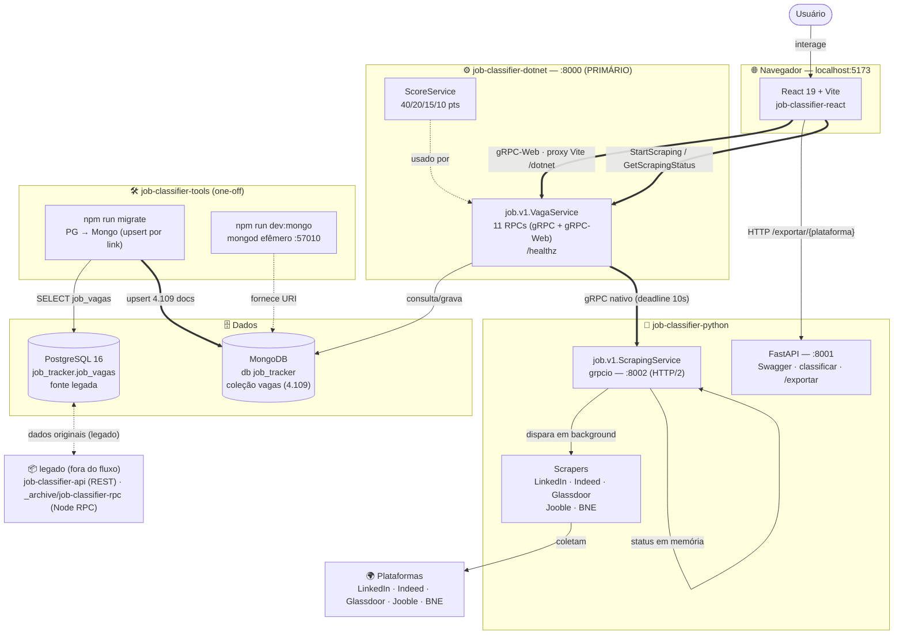

# 🗺️ Job Classifier — Arquitetura Atual e Diagrama de Fluxo

> Snapshot da arquitetura vigente (2026-09-11), pós-migração REST → gRPC e promoção do .NET a serviço primário.
> Histórico das decisões: [MIGRACAO_GRPC.md](MIGRACAO_GRPC.md) · Operação: [COMO_SUBIR_O_PROJETO.md](COMO_SUBIR_O_PROJETO.md) · Dados: [MIGRACAO_MONGODB.md](MIGRACAO_MONGODB.md)

---

## 📦 Organização em pastas

```
job-classifier/
├── proto/job/v1/              ← FONTE DA VERDADE dos contratos (vagas.proto, scraping.proto)
├── job-classifier-dotnet/     ← Serviço RPC PRIMÁRIO (ASP.NET Core, gRPC + gRPC-Web, :8000)
├── job-classifier-python/     ← Microserviço de scraping (gRPC :8002 + FastAPI :8001)
├── job-classifier-react/      ← Frontend React 19 + Vite (:5173)
├── job-classifier-tools/      ← Migração PG→Mongo e Mongo local dev (scripts npm)
├── job-classifier-api/        ← API REST legada (PostgreSQL) — fora do caminho de execução
├── _archive/job-classifier-rpc/ ← Serviço Node/ConnectRPC arquivado (referência histórica)
└── *.ps1                      ← launcher/stop/run-dotnet-dev (atalho da área de trabalho)
```

---

## 🧩 Serviços e responsabilidades

| Componente | Tecnologia | Porta | Responsabilidade |
|---|---|---|---|
| **job-classifier-dotnet** | ASP.NET Core 10 + Grpc.AspNetCore + gRPC-Web | 8000 | **Primário.** Implementa `job.v1.VagaService` (11 RPCs): listagem, filtros, status, favoritos, scores, stats, importação. Repassa scraping ao Python via gRPC. |
| **job-classifier-python (gRPC)** | Python + grpcio | 8002 | `job.v1.ScrapingService`: dispara scraping por plataforma em background threads e reporta status. |
| **job-classifier-python (FastAPI)** | Python + FastAPI | 8001 | Documentação Swagger, classificação e exportação Excel de uma plataforma (lê memória do scraper, não o banco). |
| **job-classifier-react** | React 19 + Vite + Connect-ES | 5173 | Dashboard. Fala **gRPC-Web** (`createGrpcWebTransport`) via proxy `/dotnet` do Vite. |
| **MongoDB** | Atlas M0 ou local efêmero | 57010 (local) | Coleção `vagas` (4.109 docs migrados do PG), índices únicos `link`/`id`. |
| **job-classifier-tools** | Node + tsx | — | `npm run migrate` (PG→Mongo, idempotente por `link`) e `npm run dev:mongo`. |
| *job-classifier-api* | *Node/Express + pg* | — | *Legado REST/PostgreSQL — não roda mais no fluxo principal.* |
| *_archive/job-classifier-rpc* | *Node/ConnectRPC* | — | *Arquivado após a promoção do .NET; referência histórica do mesmo contrato.* |

---

## 🔀 Fluxos principais

1. **Leitura (dashboard):** React → gRPC-Web → proxy Vite `/dotnet` → .NET `VagaService.ListVagas/GetStats` → MongoDB.
2. **Escrita (usuário):** React → .NET (`UpdateVaga`, `ToggleFavoritar`, `IgnorarVaga`...) → MongoDB.
3. **Scraping:** React → .NET `StartScraping` → gRPC → Python 8002 (threads em background) → plataformas.
4. **Importação de dados:** Python (ou job) → .NET `ImportVagas` (upsert por `link`, score calculado no servidor) → MongoDB.
5. **Excel:** React → `/exportar/{plataforma}` (HTTP) → FastAPI 8001 → gera planilha na memória do processo Python.
6. **Migração (one-off):** `job-classifier-tools` lê `job_vagas` do PostgreSQL e upserta em Mongo (idempotente).

---

## 🎨 Diagrama (Mermaid flowchart)

O arquivo `ARQUITETURA.MMD` contém o desenho abaixo, pronto para Mermaid Live Editor, VS Code (extensão Mermaid) ou Obsidian.



> 💡 **Como ler:** setas duplas `==>` = caminho principal de dados; tracejadas `-.->` = apoio/one-off.
> **gRPC-Web** existe porque navegadores não falam gRPC nativo (HTTP/2 trailer); o mesmo endpoint .NET atende os dois protocolos na porta 8000.

---

## 🩺 Pontos de verificação

| O quê | Como |
|---|---|
| .NET no ar | `curl http://localhost:8000/healthz` → `{"status":"ok","service":"job-classifier-dotnet"}` |
| Python HTTP | `curl http://localhost:8001/health` |
| Dados fluindo | `GetStats` no dashboard: 4.109 vagas / 6 plataformas |
| Portas | `netstat -ano \| findstr "8000 8001 8002 57010 5173"` |

---

## 📈 Evolução futura (já mapeada)

- **Atlas M0** em produção de verdade: preencher `MONGODB_URI` no `.env` do dotnet; nada mais muda.
- `grpc.health.v1` padrão + deadlines configuráveis no .NET.
- Server-streaming no `GetScrapingStatus` (progresso em tempo real).
- Filtros com enums proto (hoje strings de exibição, decisão v1 documentada).
- Aposentar o PostgreSQL após confiança total no Atlas (tools já cobre a migração).
